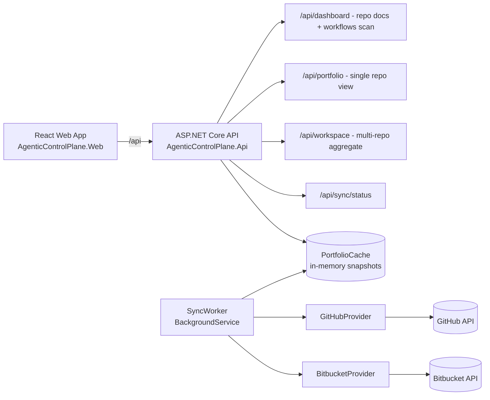
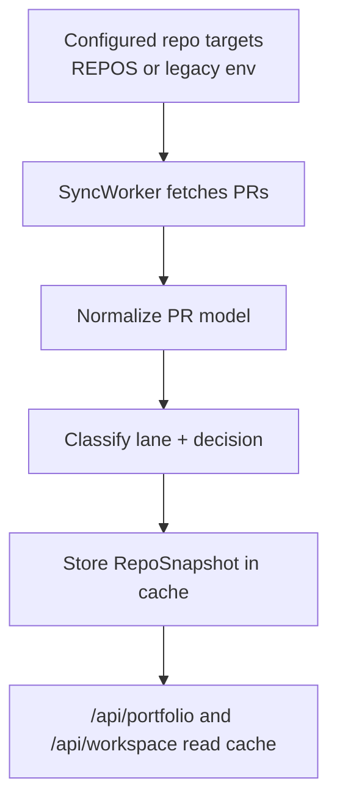

# AgenticPOC


AgenticPOC is a control-plane dashboard for an Agentic Delivery model:
- Validate ideas quickly in a prototype lane
- Promote proven candidates into hardening
- Track governance coverage, PR flow, and readiness

Mission:
> Ship better outcomes faster by validating ideas in code first, then hardening only what proves value.

## Release metadata

- Runtime targets: .NET 8, Node.js 20+
- Local ports: API 5175, Web 5173
- Sync mode: warm on startup, then periodic refresh

## TL;DR quick start

1. Clone the repository.
2. Set required values in src/AgenticControlPlane.Api/.env.
3. Run from repository root:

```powershell
./start.ps1
```

4. Open http://localhost:5173.
5. Verify API: http://localhost:5175/api/health.

## Architecture





## Stack

- Backend: ASP.NET Core 8 Minimal API
- Frontend: React + TypeScript + Vite + styled-components
- CI/CD policy: GitHub Actions workflows under .github/workflows

## Repository structure

- src/AgenticControlPlane.Api: API + sync services
- src/AgenticControlPlane.Web: UI
- docs/agentic-operating-system: playbook, policy, charter, templates
- .github/workflows: policy + release workflows
- start.ps1: local startup script

## Local run

### Option A: one-command startup (recommended)

From repository root:

```powershell
./start.ps1
```

This script clears ports 5175/5173/5174, starts API on 5175, and web on 5173 (5174 fallback).

### Option B: run services manually

API terminal:

```powershell
cd src/AgenticControlPlane.Api
dotnet restore
dotnet run --urls http://localhost:5175
```

Web terminal:

```powershell
cd src/AgenticControlPlane.Web
npm install
npm run dev
```

Open http://localhost:5173.

## Configuration matrix

API settings are loaded from src/AgenticControlPlane.Api/.env.

| Variable | Required when | Example | Default |
|---|---|---|---|
| VCS_PROVIDER | Single-repo mode | github or bitbucket | github |
| GITHUB_TOKEN | GitHub provider | ghp_xxx | empty |
| GITHUB_OWNER | Single-repo + GitHub | my-org | empty |
| GITHUB_REPO | Single-repo + GitHub | my-repo | empty |
| BITBUCKET_USERNAME | Bitbucket provider | my-user | empty |
| BITBUCKET_APP_PASSWORD | Bitbucket provider | app-password | empty |
| BITBUCKET_WORKSPACE | Single-repo + Bitbucket | my-workspace | empty |
| BITBUCKET_REPO | Single-repo + Bitbucket | my-repo | empty |
| REPOS | Multi-repo workspace | JSON array of {provider,owner,repo} | empty |
| SYNC_INTERVAL_SECONDS | Background sync cadence | 120 | 120 |

## Copy-paste .env examples

### Single repo on GitHub

```env
VCS_PROVIDER=github
GITHUB_TOKEN=ghp_your_token
GITHUB_OWNER=your-org-or-user
GITHUB_REPO=your-repo
SYNC_INTERVAL_SECONDS=120
```

### Single repo on Bitbucket Cloud

```env
VCS_PROVIDER=bitbucket
BITBUCKET_USERNAME=your-user
BITBUCKET_APP_PASSWORD=your-app-password
BITBUCKET_WORKSPACE=your-workspace
BITBUCKET_REPO=your-repo
SYNC_INTERVAL_SECONDS=120
```

### Multi-repo mixed workspace

```env
REPOS=[{"provider":"github","owner":"org-a","repo":"repo-a"},{"provider":"bitbucket","owner":"workspace-b","repo":"repo-b"}]
GITHUB_TOKEN=ghp_your_token
BITBUCKET_USERNAME=your-user
BITBUCKET_APP_PASSWORD=your-app-password
SYNC_INTERVAL_SECONDS=120
```

## API endpoints

- GET /api/health: health
- GET /api/dashboard: governance assets + coverage + highlights + metrics
- GET /api/portfolio: single-repo view (legacy compatibility, cache-backed)
- GET /api/workspace: multi-repo view + aggregate metrics
- GET /api/sync/status: sync observability

Note: /api/portfolio and /api/workspace may return 202 while initial cache warm-up runs.

### Example: GET /api/health

```json
{
  "status": "ok"
}
```

### Example: GET /api/dashboard

```json
{
  "assets": [
    {
      "label": "Playbook",
      "path": "docs/agentic-operating-system/AGENTIC_DELIVERY_PLAYBOOK.md",
      "kind": "markdown",
      "ok": true,
      "summary": { "sections": 18, "bullets": 42 },
      "error": null
    }
  ],
  "workflowCoverage": [
    { "label": ".github/workflows/agentic-delivery-gates.yml", "pass": true }
  ],
  "highlights": [
    { "label": "Two-lane model defined", "pass": true }
  ],
  "metrics": {
    "cycleTime": "18h",
    "conversionRate": "27%",
    "killRate": "51%"
  }
}
```

### Example: GET /api/portfolio

```json
{
  "repoMeta": {
    "owner": "my-org",
    "repo": "my-repo",
    "url": "https://github.com/my-org/my-repo",
    "provider": "GitHub",
    "syncedAt": "2026-04-21T18:22:01.230Z"
  },
  "items": [
    {
      "number": 42,
      "title": "Experiment: add readiness gate",
      "branch": "exp/readiness-gate",
      "lane": "prototype",
      "state": "open",
      "labels": ["experiment"],
      "decision": "open",
      "ageHours": 12.7,
      "author": "dev-user",
      "url": "https://github.com/my-org/my-repo/pull/42",
      "createdAt": "2026-04-21"
    }
  ],
  "experiments": [],
  "hardening": [],
  "promoted": [],
  "killed": [],
  "metrics": {
    "cycleTime": "12.7h",
    "conversionRate": "33.3%",
    "killRate": "20.0%"
  }
}
```

### Example: GET /api/workspace

```json
{
  "repos": [
    {
      "key": "github:my-org/my-repo",
      "provider": "github",
      "owner": "my-org",
      "repo": "my-repo",
      "repoUrl": "https://github.com/my-org/my-repo",
      "syncedAt": "2026-04-21T18:22:01.230Z",
      "syncError": null,
      "totalPrs": 14,
      "experiments": [],
      "hardening": [],
      "promoted": [],
      "killed": [],
      "metrics": {
        "cycleTime": "18h",
        "conversionRate": "31.2%",
        "killRate": "42.8%"
      }
    }
  ],
  "totalRepos": 1,
  "oldestSync": "2026-04-21T18:22:01.230Z",
  "aggregate": {
    "cycleTime": "18h",
    "conversionRate": "31.2%",
    "killRate": "42.8%"
  }
}
```

### Example: warming state

```json
{
  "status": "syncing",
  "message": "Initial sync in progress — please retry in a moment."
}
```

### Example: GET /api/sync/status

```json
{
  "repoCount": 2,
  "oldestSync": "2026-04-21T18:20:12.880Z",
  "repos": [
    {
      "key": "github:org-a/repo-a",
      "syncedAt": "2026-04-21T18:20:12.880Z",
      "prCount": 11,
      "syncError": null
    },
    {
      "key": "bitbucket:workspace-b/repo-b",
      "syncedAt": "2026-04-21T18:20:15.041Z",
      "prCount": 9,
      "syncError": null
    }
  ]
}
```

## PR lane and decision model

Lane by branch prefix: exp/ -> prototype, harden/ -> hardening, hotfix/ -> hotfix, else -> other.

Decision mapping: kill label -> kill, hardened label -> promote, promote-candidate label -> promote-candidate, closed/merged without kill -> merged, else -> open.

## GitHub workflows and outcomes

| Workflow | File | Trigger | Pass criteria | Failure effect | Output | What to do when it fails |
|---|---|---|---|---|---|---|
| Agentic Delivery Gates | .github/workflows/agentic-delivery-gates.yml | pull_request events | Valid branch routing and required PR body sections/fields | Workflow fails | Branch-based labels (experiment, hardened, high-risk-change) | Fix routing/body fields and push update |
| Hardening Checklist Gate | .github/workflows/hardening-checklist-gate.yml | pull_request events | Required hardening checklist section + checked required boxes | Workflow fails | Gate signal in PR checks | Check required hardening boxes and update PR |
| Promotion Readiness Score | .github/workflows/promotion-readiness-score.yml | pull_request events | Scoring completes and critical categories pass | Workflow fails on critical failures | Bot comment with score, recommendation, and rubric | Resolve failed critical categories from bot rubric comment |
| Staged Release | .github/workflows/staged-release.yml | workflow_dispatch | Valid inputs, canary deploy, optional full rollout approval | Job step fails | Deployment job logs and rollout progression | Fix input/deploy issue and rerun workflow_dispatch |

## Operational runbook

### Expected behavior

- First calls may return warming responses for /api/portfolio and /api/workspace.
- SyncWorker runs at startup, then on SYNC_INTERVAL_SECONDS cadence.

### What to monitor

- GET /api/sync/status:
  - repoCount is expected
  - syncedAt advances over time
  - syncError stays null

### Recovery checklist

1. Confirm credentials and repo identifiers in .env.
2. Call /api/sync/status and inspect syncError.
3. Restart API process after fixing env values.
4. Re-check /api/workspace and /api/portfolio.

## Security guidance

- Use least-privilege tokens only.
- Keep .env out of source control; rotate secrets if exposed.
- Prefer repo-scoped credentials over broad account-wide credentials.
- For Bitbucket, use app-password scopes required for reading pull requests only.
- Do not paste secrets into PR descriptions or workflow inputs.

## Governance docs consumed by dashboard

Scanned assets:

- docs/agentic-operating-system/AGENTIC_DELIVERY_PLAYBOOK.md
- docs/agentic-operating-system/REPO_POLICY_GUIDE.md
- docs/agentic-operating-system/TEAM_CHARTER_ONE_PAGE.md
- docs/agentic-operating-system/templates/HYPOTHESIS_BRIEF_TEMPLATE.md
- docs/agentic-operating-system/templates/PROMOTION_CHECKLIST.md
- docs/agentic-operating-system/templates/WEEKLY_PORTFOLIO_REVIEW.md
- .github/workflows/agentic-delivery-gates.yml
- .github/workflows/hardening-checklist-gate.yml
- .github/workflows/promotion-readiness-score.yml
- .github/workflows/staged-release.yml

## Extend the system

### Add a new VCS provider

1. Implement IVcsProvider in a new adapter under src/AgenticControlPlane.Api/Providers.
2. Return normalized pull requests with the shared internal model.
3. Register provider and resolver mapping in Program.cs.

### Add a new metric

1. Compute from ClassifiedPr in sync snapshot logic.
2. Add field to response shape.
3. Display in frontend workspace or portfolio panels.

### Add a new gate workflow

1. Create workflow under .github/workflows.
2. Define explicit pass/fail criteria and required inputs.
3. Add workflow description to this README.

## Troubleshooting

- API returns syncing response:
  - Wait for initial sync, then retry /api/portfolio or /api/workspace.
- Empty workspace data:
  - Validate REPOS JSON format and credentials.
- Web cannot reach API:
  - Confirm API is on http://localhost:5175 and Vite proxy is active.
- Bitbucket data missing:
  - Confirm app password scopes and workspace/repo slugs.

## Notes

- app/README.md describes archived app folder status.
- src/README.md contains service-level run notes.
